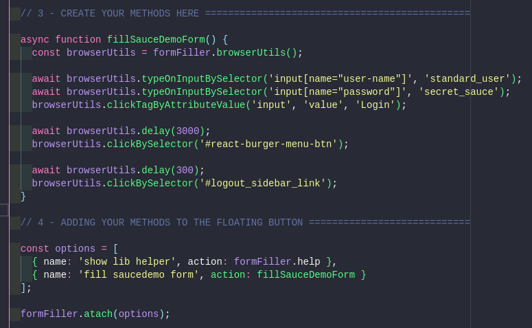
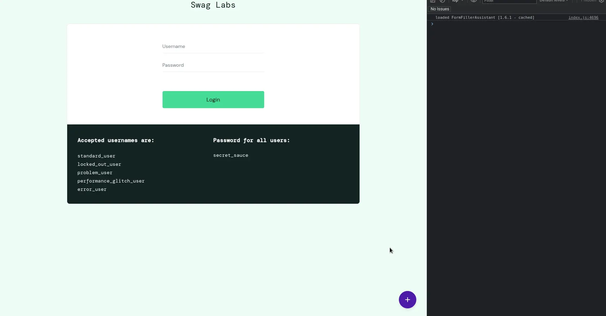

<a name="TOC"></a>

<h3 align="center">
  FORM FILLER ASSISTANT
</h3>

<div align="center">
  <a href="https://www.npmjs.com/package/form_filler_assistant"></a>
  <a href="https://nodejs.org/en/"></a>
  <a href="https://github.com/lucasvtiradentes/form_filler_assistant#contributing"></a>
</div>

<p align="center">
  <a href="#dart-features">Features</a> • <a href="#warning-requirements">Requirements</a> • <a href="#bulb-usage">Usage</a> • <a href="#wrench-development">Development</a> • <a href="#books-about">About</a>
</p>

<details>
  <summary align="center"><span>see <b>table of content</b></span></summary>
  <p align="center">
    <ul>
      <li><a href="#trumpet-overview">Overview</a></li>
          <li><a href="#motivation">Motivation</a></li>
      <li><a href="#dart-features">Features</a></li>
      <li><a href="#warning-requirements">Requirements</a></li>
      <li>
        <a href="#bulb-usage">Usage</a>
        <ul>
          <li><a href="#install">Install</a></li>
          <li><a href="#uninstall">Uninstall</a></li>
          <li><a href="#how-it-works">How it works</a></li>
          <li><a href="#available-methods">Available methods</a></li>
        </ul>
      </li>
      <li>
        <a href="#wrench-development">Development</a>
        <ul>
          <li><a href="#development-setup">Development setup</a></li>
          <li><a href="#used-technologies">Used technologies</a></li>
        </ul>
      </li>
      <li>
        <a href="#books-about">About</a>
        <ul>
          <li><a href="#related">Related</a></li>
          <li><a href="#license">License</a></li>
          <li><a href="#feedback">Feedback</a></li>
        </ul>
      </li>
    </ul>
  </p>
</details>

<a href="#"></a>

## :trumpet: Overview

Easily fill forms on websites with an easy to use temper monkey userscript.

<div align="center">
  <table>
  <thead>
    <tr>
      <th>code</th>
      <th>result</th>
    </tr>
  </thead>
    <tbody>
      <tr>
        <td></td>
        <td></td>
      </tr>
    </tbody>
  </table>
</div>

Instead of manually filling out a four-step React form to view your current working page, why not simplify the process by clicking a button that completes it for you? 🤖

## :question: Motivation

My main motivation for building this tool was to save time when filling out forms in my React applications during the development phase.

* It's important to note that this tool does not aim (or would be able) to replace end-to-end testing tools. Instead, it serves as a more efficient and faster option specifically for development phase.
* I have explored other solutions such as [Cypress](https://www.cypress.io) and [Selenium](https://chrome.google.com/webstore/detail/selenium-ide/mooikfkahbdckldjjndioackbalphokd), but they didn't meet my needs for:
  * Keyboard shortcuts;
  * Synchronization between multiple developers;
  * Randomly generated data, particularly unique Brazilian person and company numbers like CPF and CNPJ;
  * Allow me to fill the form while inside my vscode debugger chrome instance.

## :dart: Features<a href="#TOC"></a>

&nbsp;&nbsp;&nbsp;✔️ atach a floating buttom with custom actions (`ctrl+space` or `alt+space` to toogle it);<br>
&nbsp;&nbsp;&nbsp;✔️ out of the box methods to fill website forms (type, click, etc);<br>
&nbsp;&nbsp;&nbsp;✔️ dynamic keybinding to all available options (`1-9`) when the options container is displayed;<br>
&nbsp;&nbsp;&nbsp;✔️ auto-updatable temper monkeys [userscript](./examples/3_with_header_buttons.js);<br>
&nbsp;&nbsp;&nbsp;✔️ allow custom configs (color scheme, debug_mode, etc);<br>
&nbsp;&nbsp;&nbsp;✔️ ready to use examples provided on [./examples](./examples).<br>

## :warning: Requirements<a href="#TOC"></a>

The only requirement to use this project is [temper monkey](https://chrome.google.com/webstore/detail/tampermonkey/dhdgffkkebhmkfjojejmpbldmpobfkfo?hl=pt-BR), a browser extension which allow us to autorun some javascript on certain specified websites.

## :bulb: Usage<a href="#TOC"></a>

### Install

* 1 - install [temper monkey](https://chrome.google.com/webstore/detail/tampermonkey/dhdgffkkebhmkfjojejmpbldmpobfkfo?hl=pt-BR) to your browser;
* 2 - click on "temper monkey icon" and after on "Create a new script...";
* 3 - paste the initial temper monkey basic example [1_basic.js](./examples/1_basic.js) to the document content and save it;
* 4 - go to the [saucedemo](https://www.saucedemo.com) site and hit `ctrl+space` or `alt+space` to show the options menu;
* 4 - click on the available options or hit the `numeric keys (1 - 9)` when the options menu appears;
* 5 - get inspired by the other [./examples](./examples) and have fun!

### Uninstall

If you want to uninstall, just remove the temper monkey userscript on its dashboard.

### How it works

This project will

- atach a floating button with custom options to the specified website;
- it will get the package content from [jsdelivr](https://cdn.jsdelivr.net/npm/form_filler_assistant) and save it to local storage so you dont have to fetch it all the time;
- if you want to update it, simply click on the header icon, as shown in the example [3_with_header_buttons.js](./examples/3_with_header_buttons.js).

### Available methods

<details>
  <summary align="center">Show all available methods</summary>
  <div>
<br>

This package comes with the following commands list:

<table>
  <tr>
    <th>Command</th>
    <th>Methods</th>
    <th>Description</th>
  </tr>
  <tr>
    <td rowspan="1"><code>atach(optionsArr, headerOptionsArr?)</code></td>
    <td>-</td>
    <td>Used to atach your options to the floating button. You can also specify custom header options.</td>
  </tr>
  <tr>
    <td rowspan="1"><code>help()</code></td>
    <td>-</td>
    <td>Show helper information on runtime environment.</td>
  </tr>
  <tr>
    <td rowspan="7"><code>dataUtils()</code></td>
    <td><code>.generateCNPJ()</code></td>
    <td>Generate a unique Brazilian identification number for each company.</td>
  </tr>
  <tr>
    <!-- <td rowspan="1"><code>dataUtils()</code></td> -->
    <td><code>.generateCPF()</code></td>
    <td>Generate a unique Brazilian identification number for each individual.</td>
  </tr>
  <tr>
    <!-- <td rowspan="1"><code>dataUtils()</code></td> -->
    <td><code>.generateRandomNumbers(length)</code></td>
    <td>Generate a randomly generated number with a specified length.</td>
  </tr>
  <tr>
    <!-- <td rowspan="1"><code>dataUtils()</code></td> -->
    <td><code>.generateCompanyName()</code></td>
    <td>Generate a randomly generated company name.</td>
  </tr>
  <tr>
    <!-- <td rowspan="1"><code>dataUtils()</code></td> -->
    <td><code>.generatePersonName()</code></td>
    <td>Generate a randomly generated person name.</td>
  </tr>
  <tr>
    <!-- <td rowspan="1"><code>dataUtils()</code></td> -->
    <td><code>.generatePersonEmail()</code></td>
    <td>Generate a randomly generated person email.</td>
  </tr>
  <tr>
    <!-- <td rowspan="1"><code>dataUtils()</code></td> -->
    <td><code>.generatePersonUsername()</code></td>
    <td>Generate a randomly generated person username.</td>
  </tr>
  <tr>
    <td rowspan="12"><code>browserUtils()</code></td>
    <td><code>.delay(milliseconds, ignoreLog?)</code></td>
    <td>Introduces a delay in the program execution for the specified number of milliseconds. If ignoreLog parameter is provided and set to true, the function will suppress any logging or output during the delay.</td>
  </tr>
  <tr>
    <!-- <td rowspan="1"><code>browserUtils()</code></td> -->
    <td><code>.getElementByTagText(tag, textToFind, itemIndex?)</code></td>
    <td>Returns the HTML element with the specified tag that contains the given text to find. If itemIndex is provided, it retrieves the element at the specified index when multiple elements are found.</td>
  </tr>
  <tr>
    <!-- <td rowspan="1"><code>browserUtils()</code></td> -->
    <td><code>.getElementByTagAttributeValue(tag, attribute, attributeValue, itemIndex?)</code></td>
    <td>Returns the HTML element with the specified tag that has the attribute matching the given attribute value. If itemIndex is provided, it retrieves the element at the specified index when multiple elements are found.</td>
  </tr>
  <tr>
    <!-- <td rowspan="1"><code>browserUtils()</code></td> -->
    <td><code>.getElementBySelector(selector)</code></td>
    <td>Returns the HTML element that matches the specified CSS selector. The selector can be used to target elements by tag name, class name, ID, or other CSS selectors.</td>
  </tr>
  <tr>
    <!-- <td rowspan="1"><code>browserUtils()</code></td> -->
    <td>.typeOnInputByElement(htmlElement, text)</td>
    <td>Simulates typing the specified text into the given htmlElement. This function interacts with the HTML input element and populates it with the provided text.</td>
  </tr>
  <tr>
    <!-- <td rowspan="1"><code>browserUtils()</code></td> -->
    <td><code>.typeOnInputBySelector(selector, text)</code></td>
    <td>Simulates typing the specified text into the HTML input element selected using the given selector. This function interacts with the input element matching the selector and populates it with the provided text.</td>
  </tr>
  <tr>
    <!-- <td rowspan="1"><code>browserUtils()</code></td> -->
    <td><code>.clickElement(htmlElement)</code></td>
    <td>Simulates a click on the specified htmlElement. This function triggers a click event on the element, simulating a user interaction as if the element were physically clicked.</td>
  </tr>
  <tr>
    <!-- <td rowspan="1"><code>browserUtils()</code></td> -->
    <td><code>.clickElementBySelector(selector)</code></td>
    <td>Simulates a click on the HTML element selected using the given selector. This function triggers a click event on the element matching the selector, simulating a user interaction as if the element were physically clicked.</td>
  </tr>
  <tr>
    <!-- <td rowspan="1"><code>browserUtils()</code></td> -->
    <td><code>.clickElementByTagText(tag, textToFind, itemIndex?)</code></td>
    <td>Simulates a click on the HTML element with the specified tag that contains the given textToFind. If itemIndex is provided, it clicks on the element at the specified index when multiple elements are found. This function simulates a user interaction as if the element were physically clicked.</td>
  </tr>
  <tr>
    <!-- <td rowspan="1"><code>browserUtils()</code></td> -->
    <td><code>.clickElementByTagAttributeValue(tag, attribute, attributeValue, itemIndex?)</code></td>
    <td>Simulates a click on the HTML element with the specified tag that has the attribute matching the given attributeValue. If itemIndex is provided, it clicks on the element at the specified index when multiple elements are found. This function simulates a user interaction as if the element were physically clicked.</td>
  </tr>
  <tr>
    <!-- <td rowspan="1"><code>browserUtils()</code></td> -->
    <td><code>.generateFormRow(name, value, onAfterClickAction?)</code></td>
    <td>Generates a form row with the specified name and value. If onAfterClickAction is provided, it specifies an optional action to perform after clicking the form row.</td>
  </tr>
  <tr>
    <!-- <td rowspan="1"><code>browserUtils()</code></td> -->
    <td><code>.getModal(title)</code></td>
    <td>Utility function for easily handling modals on the options. The function returns two functions, one to update the modal's content and another to close the modal.</td>
  </tr>
</table>
  </div>
</details>


## :wrench: Development<a href="#TOC"></a>

### Development setup

<details>
  <summary align="center">Show instructions for development setup</summary>
  <div>
<br>
To setup this project in your computer, run the following commands:

```bash
# Clone this repository
$ git clone https://github.com/lucasvtiradentes/form_filler_assistant

# Go into the repository
$ cd form_filler_assistant

# Install dependencies
$ npm install
```

If you want to [contribute](./docs/CONTRIBUTING.md) to the project, fork the project, make the necessary changes, and to test your work you can load the <code>./tests/index.html</code> on your browser after run a <code>npm run build</code> command.
  </div>
</details>

### Used technologies

This project uses the following thechnologies:

<div align="center">
  <table>
    <tr>
      <th>Scope</th>
      <th>Subject</th>
      <th>Technologies</th>
    </tr>
    <tr>
      <td rowspan="1">Main</td>
      <td>Main</td>
      <td align="center">
        <a href="https://nodejs.org/"></a>
        <a href="https://www.typescriptlang.org/"></a>
      </td>
    </tr>
    <tr>
      <td rowspan="3">Setup</td>
      <td>Code linting</td>
      <td align="center">
        <a href="https://github.com/prettier/prettier"></a>
        <a href="https://github.com/eslint/eslint"></a>
      </td>
    </tr>
    <tr>
      <!-- <td rowspan="2">Setup</td> -->
      <td>Commit linting</td>
      <td align="center">
      <a target="_blank" href="https://github.com/conventional-changelog/commitlint"></a>
      <a target="_blank" href="https://github.com/commitizen/cz-cli"></a>
      <a href="https://gitmoji.dev"></a>
      </td>
    </tr>
    <tr>
      <!-- <td rowspan="2">Setup</td> -->
      <td>Other</td>
      <td align="center">
        <a href="https://editorconfig.org/"></a>
        <a target="_blank" href="https://github.com/typicode/husky"></a>
        <a target="_blank" href="https://github.com/okonet/lint-staged"></a>
      </td>
    </tr>
  </table>
</div>

<a href="#"></a>

## :books: About<a href="#TOC"></a>

## Related

- [cypress](https://www.cypress.io): With Cypress, you can easily create tests for your modern web applications, debug them visually, and automatically run them in your continuous integration builds;
- [robotframework](https://robotframework.org): Robot Framework is a generic open source automation framework. It can be used for test automation and robotic process automation (RPA);
- [selenium IDS](https://chrome.google.com/webstore/detail/selenium-ide/mooikfkahbdckldjjndioackbalphokd): Selenium Record and Playback tool for ease of getting acquainted with Selenium WebDriver.

## License

This project is distributed under the terms of the MIT License Version 2.0. A complete version of the license is available in the [LICENSE](LICENSE) file in this repository. Any contribution made to this project will be licensed under the MIT License Version 2.0.

## Feedback

If you have any questions or suggestions you are welcome to discuss it on [github issues](https://github.com/lucasvtiradentes/form_filler_assistant/issues) or, if you prefer, you can reach me in my social media provided bellow.

<a href="#"></a>

<div align="center">
  <p>
    <a target="_blank" href="https://www.linkedin.com/in/lucasvtiradentes/"></a>
    <a target="_blank" href="mailto:lucasvtiradentes@gmail.com"></a>
    <a target="_blank" href="https://discord.com/users/262326726892191744"></a>
    <a target="_blank" href="https://github.com/lucasvtiradentes/"></a>
  </p>
  <p>Made with ❤️ by Lucas Vieira.</p>
  <p>👉 See also all <a href="https://github.com/lucasvtiradentes/lucasvtiradentes/blob/master/portfolio/PROJECTS.md#TOC">my projects</a></p>
  <p>👉 See also all <a href="https://github.com/lucasvtiradentes/my-tutorials#readme">my articles</a></p>
</div>
